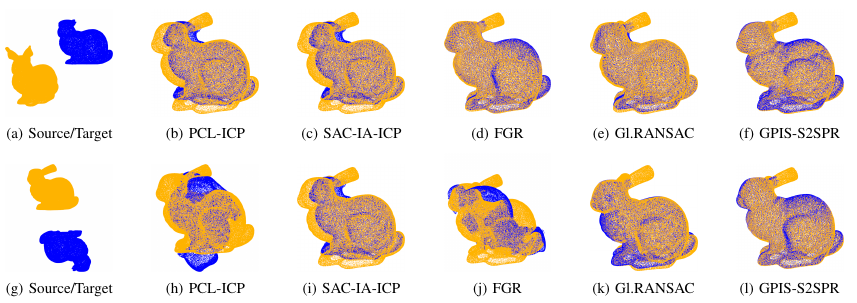

## 6D pose estimation for flexible production with small lot sizes based on CAD models using gaussian process implicit surfaces
#### [[paper]](https://mediatum.ub.tum.de/doc/1555279/cr7t1w2a65qkekhn3em4lm75c.gpis-gr.pdf)[[project page]](https://linjianjie.github.io/gpisS2SPr/)	

### Introduction

GPISPR is a Gaussian Process implicit surface based point registration, which utilizes the concept of manifold. Its based on our IROS2020 [[paper]](https://mediatum.ub.tum.de/doc/1555279/cr7t1w2a65qkekhn3em4lm75c.gpis-gr.pdf)
more details please refers to our paper
 

### Usage
#### 1) Prerequisite
1. Install dependencies via `pip3 install -r requirments.txt`.
2. Follow [this guide](http://open3d.org/docs/getting_started.html) to install Open3D for point cloud I/O.

### running the demo
1. voxel size for the objects should be set
2. the alpha in the GPIS should be tunned for enable an psd convariance matrix
3. use_init4 parameter is try to solve the PCA sign ambitious problem. In the default, the first init is chosen. but in some cases, PCA can not result in a correct initial alignment. Then you may need to enable the init4 options to chose the correct sign

### Lie Algebra
1. we use the [Lie algebra libray](https://github.com/utiasSTARS/liegroups) to express lie operator 
### Limitations
1. Due to the complexity of Gaussian Process, the number of Point cloud shoud not be very bigger. It will be suggested aroundg 2000-3000 way points    
2. the outer linr generation is depends on the modified [Mesh2SDF](https://github.com/marian42/mesh_to_sdf), sometime, it will results in a bad distribution. Then, please try to regenerate a new distribution of out lier points


### Citation
If you find our work useful for your research, please cite:
```
@InProceedings{lingpis2020,
    author={Lin, Jianjie and Rickert, Markus and Knoll, Alois},
    booktitle={2020 IEEE/RSJ International Conference on Intelligent Robots and Systems (IROS)}, 
    title={6D Pose Estimation for Flexible Production with Small Lot Sizes based on CAD Models using Gaussian Process Implicit Surfaces}, 
    year={2020},
    volume={},
    number={},
    pages={10572-10579},
    doi={10.1109/IROS45743.2020.9341189}
    }
```
### License
This project Code is released under the GPLv2 License (refer to the LICENSE file for details).